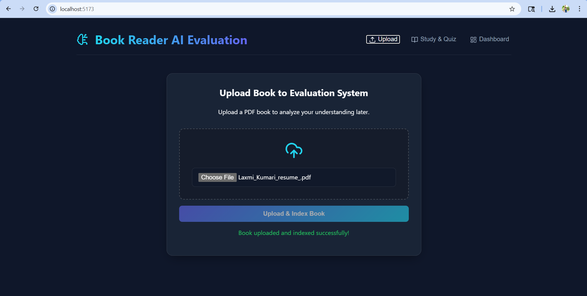
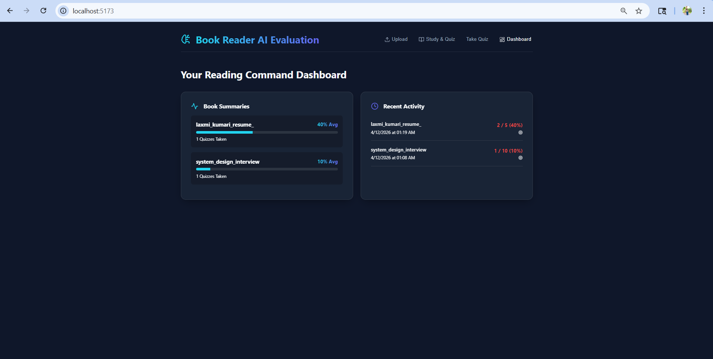
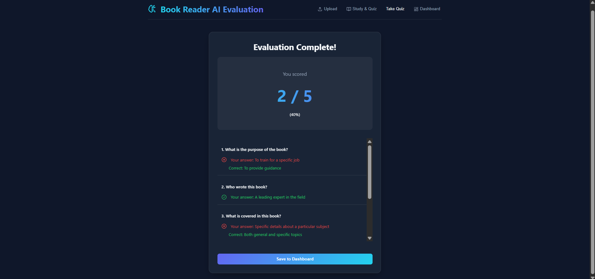

# BookReaderAI - RAG-Based Knowledge Assessment System 🧠📖

BookReaderAI is a powerful Retrieval-Augmented Generation (RAG) system that allows users to upload PDF books, study their contents intelligently, and automatically generate quizzes based on the material. It leverages local LLMs via Ollama to ensure complete privacy while providing high-quality, context-aware answers and assessments.

## ✨ Features

- **PDF Book Management**: Securely upload and store PDF documents in AWS S3, while simultaneously processing and chunking their textual content.
- **AI-Powered Study Assistant**: Ask specific, contextual questions about the book content, powered by RAG and a local Llama 3.2 model.
- **Automated Quiz Generation**: Automatically generate highly structured Multiple Choice Questions (MCQ) based on specific chapters, topics, or custom instructions.
- **Interactive Quiz Taker & Dashboard**: Take quizzes directly in the web application and track your learning progress and scores on an intuitive dashboard.

## 🛠️ Technology Stack

- **Frontend**: React, TypeScript, Vite, Lucide React
- **Backend**: Java 21, Spring Boot 3.5, Spring AI, Gradle
- **Database**: PostgreSQL (e.g. Neon) with `pgvector` extension for storing and querying vector embeddings
- **Storage**: AWS S3 for scalable PDF blob storage
- **AI / LLM Engine**: 
  - **Ollama** (Running Locally)
  - **Chat Model**: `llama3.2:1b`
  - **Embedding Model**: `mxbai-embed-large` (1536-dimension embeddings)

## 📸 Screenshots

| Upload Book | Dashboard | Quiz Evaluation |
|-------------|-----------|-----------------|
|  |  |  |

---

## 🚀 Getting Started (Local Setup)

### Prerequisites
Before you start, ensure you have the following installed and set up:
- **Java 21**
- **Node.js** (v18+)
- **Git**
- **Ollama** (Download from [ollama.com](https://ollama.com/))
- **AWS Account** with an active S3 bucket
- **PostgreSQL instance** with `pgvector` enabled (e.g., Neon Cloud DB)

### 1. Start Local LLM with Ollama
Make sure Ollama is installed and running in the background. Then, pull the required models by running these commands in your terminal:
```bash
ollama pull llama3.2:1b
ollama pull mxbai-embed-large
```
Ollama will serve the models on `http://localhost:11434`.

### 2. Database & AWS Configuration
You need to provide your exact PostgreSQL and AWS credentials to the Spring Boot backend.

**Database Setup**: 
The app expects your Postgres credentials to be provided as Environment Variables. Set the following in your system:
- `DB_URL`: The JDBC connection URL (e.g., `jdbc:postgresql://<host>/<dbname>...`)
- `DB_USERNAME`: Your DB username
- `DB_PASSWORD`: Your DB password

**AWS S3 Setup**:
Open `backend/src/main/java/com/bookreaderai/backend/BlobStorage/S3.java` and update the AWS credentials keys matching your account:
```java
String accessKey = "<your_aws_access_key>";
String secretKey = "<your_aws_secret_key>";
String regionName = "ap-south-1"; // update if different
```

*(Note: It is highly advised to migrate S3 credentials to environment variables for production security)*

### 3. Run the Backend
Navigate to the backend directory and launch the Spring Boot server using Gradle.

**Windows**:
```bash
cd backend
gradlew.bat bootRun
```

**macOS/Linux**:
```bash
cd backend
./gradlew bootRun
```
The backend will ignite and become available at `http://localhost:8080`.

### 4. Run the Frontend
Open a new terminal window, navigate to the frontend directory, install the required dependencies, and start the Vite dev server.
```bash
cd frontend
npm install
npm run dev
```
The frontend application will be instantly available in your browser at `http://localhost:5173`. 

---

## 📝 Usage Guide
1. **Upload Tab**: Start by uploading any PDF book. The backend extracts the text, creates vector embeddings for it, and uploads the original PDF to AWS S3. 
2. **Study & Quiz Tab**: Select a previously uploaded book. You can either type questions to chat with the book or provide an instruction to generate a dynamic quiz (e.g. "Create 5 multiple choice questions about Chapter 1").
3. **Take Quiz**: Complete the AI-generated quiz and submit your answers. 
4. **Dashboard**: Navigate to your dashboard to review your past quiz attempts, overall scores, and progression!

## 📄 License
This project is for educational and portfolio demonstration. Feel free to use and expand on its capabilities!
